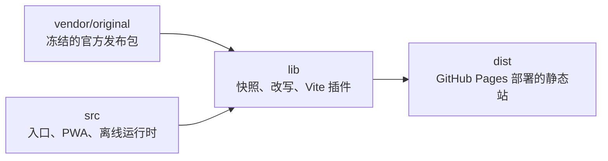
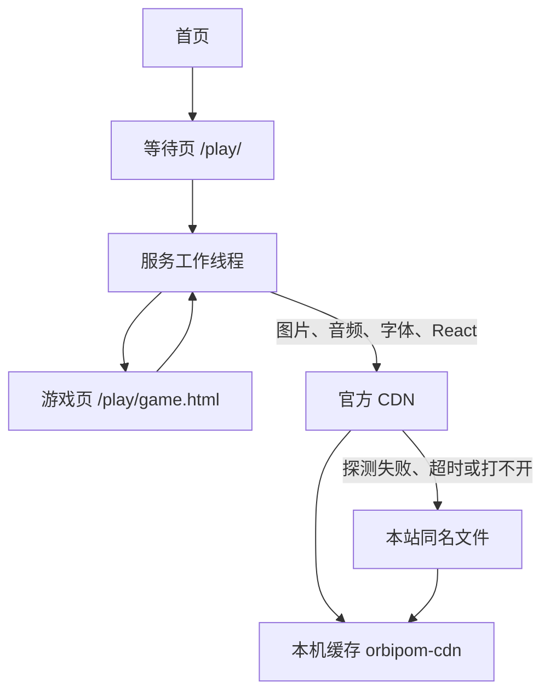
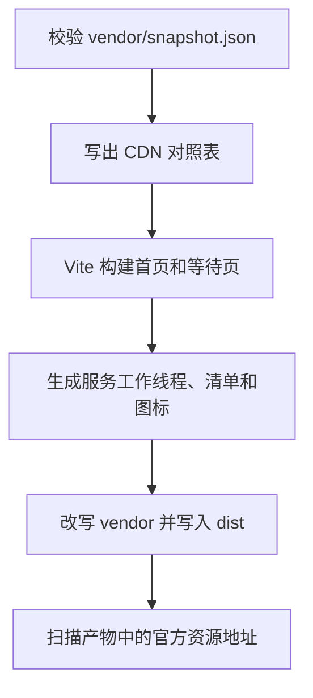

- [仓库里的三层](#仓库里的三层)
- [运行时](#运行时)
  - [入口和等待页](#入口和等待页)
  - [服务工作线程](#服务工作线程)
  - [游戏页和离线契约](#游戏页和离线契约)
  - [本地档案](#本地档案)
- [构建](#构建)
  - [校验快照](#校验快照)
  - [附加页面](#附加页面)
  - [原版改写](#原版改写)
  - [原版包里走不到的功能](#原版包里走不到的功能)

<h1>Contributing</h1>

这份文档说明仓库如何把《明日方舟：终末地》网页活动「融合！山团团！」收成可离线游玩的静态站。

原版前端锁定为 `v1d5-synthesize-tuantuan-web@1.1.2`。玩法、美术、动画和音效仍来自官方发布包。本仓库补上入口、PWA、资源加载和本地存档，并关掉登录、成绩上报、奖励和遥测。

## 仓库里的三层

- `vendor`
    - `vendor/original/` 是官方发布包，含页面、脚本、图片、音频和字体。
    - `vendor/snapshot.json` 记下每个文件的路径、来源地址、字节数和 sha256。
- `src/` 是附加页面和浏览器里的离线层，不重写玩法。
- `lib/` 在构建和本地开发时把这两边接起来。它不进入浏览器，除了生成给服务工作线程用的 CDN 对照表。

## 运行时

玩家看到的站点是构建产物。一次进入游戏经过入口、服务工作线程、游戏页三层。资源请求再在官方 CDN、本站备份和本机缓存之间选择。

### 入口和等待页

首页 `src/index.html` 说明来源和免责声明，并链接到 `/play/`。样式在 `src/index.css`。

`src/play/index.html` 和 `src/play/boot.js` 只做一件事：注册服务工作线程，等它就绪后进入 `/play/game.html`。等待最多 8 秒。注册失败时页面改为「页面缓存没有就绪，正在进入游戏」，随后仍然进入游戏页。此时服务工作线程没有接管请求，官方 CDN 优先不会生效，浏览器直接向本站要文件。

游戏页本身由构建从 `vendor/original/official-index.html` 生成，源码树里没有这份 HTML。

### 服务工作线程

`src/sw.js` 用 Workbox 组装三件事，PWA 插件在构建时把预缓存清单注入这份文件：

- `precacheAndRoute` 预缓存壳层：首页、等待页、游戏页、遥测空实现，以及 `assets/` 里的脚本、样式和图标。图片、音频、字体和原版脚本不进预缓存，安装时不会下载整包素材。
- `src/pwa/navigation.js` 把文档导航交给对应 HTML。`/play/` 打开等待页，其余文档导航打开首页。
- `src/pwa/cdn-fallback.js` 决定媒体和 React 向谁要。

安装时先请求官方 favicon 做探测，超时 5 秒。探测成功则后续同类资源优先向官方 CDN 要，单次超时 8 秒。探测失败或请求超时后，这次服务工作线程的生命周期里改向本站同名文件。官方返回了非成功状态时，只这一次改用本站文件，之后仍会再试官方地址。本站文件是 GitHub Pages 上的构建产物，比官方 CDN 慢。成功的响应写入缓存 `orbipom-cdn`。本站也失败时，再用这份缓存。

对照表在构建时写成 `lib/generated/cdn-manifest.js`。键是本站路径，值是快照里的官方来源。能进这张表的是带 `sourceUrl`、且属于图片、音频、字体、图标或 React 18.3.1 的文件。改过的游戏脚本、入口脚本和文案脚本被排除，始终用本站文件。

同一地址在预缓存清单里只能有一条。重复时 Workbox 在服务工作线程启动时抛错，注册失败，等待页就会显示缓存没有就绪。`vite.config.js` 里的 `globPatterns` 因此只覆盖壳层，并用 `globIgnores` 排除 `site/`、`vendor/` 和 `shared/`。

图标由 `vite-plugin-pwa` 从 `vendor/original/site/assets/imgs/11.3df86f.png` 生成到 `dist/assets/`，同时写入 Web App 清单。

### 游戏页和离线契约

游戏页挂上内容安全策略，只允许本站脚本、样式和连接。官方接口地址在构建时被改成本站路径，页面不会向活动服务器发请求。

离线运行时由 `src/offline/index.js` 安装到 `window.orbipom`：

- `api` 替代原版活动接口，见 `src/offline/api.js`。
- `prepareSdk` 改写内联 SDK 的 `Bridge` 和 `WebView`，见 `src/offline/sdk.js`。
- `connect` 订阅原版对局状态，把合成、战技、图鉴和最高分记入本地档案，见 `src/offline/session.js`。
- `ignoreTelemetry` 吞掉错误上报。遥测脚本地址被换成 `src/offline/no-telemetry.js`。

启动时还会写入 `sessionStorage` 的 `u8_token` 和 `server`，并设置 `window.WVSDK`。平台被固定成 Qt，原版因此走内嵌客户端分支：使用内联 SDK，不加载网页登录壳。关闭游戏时保存档案并回到首页。分享改为下载本地图片。

`prepareSdk` 包住的是已经打进 `vendor/original/site/index.3d8293.js` 的那份 SDK（webpack 模块 61402）。原版浏览器分支本来会动态插入 `sdk.entry.js`。构建把这次加载换成包内的空实现，独立的 `hg-web-sdk` 不在仓库里。

### 本地档案

档案存在 `localStorage`，键名 `orbipom.offline.profile.v1`，`schema` 必须为 `1`。字段包括昵称、最高分、已提交最高分、图鉴上限、引导是否完成、累计合成、累计战技、分享标记和最近 100 条结算。分数上限 99999，昵称最长 24 字，图鉴范围 5 到 11。写入有 300 毫秒合并。存储不可用时只留在内存，并在控制台提示用 F10 导出。

F10 或页面上的「本地离线 · F10」打开 `src/offline/panel.js`。面板会暂停对局，可导出或导入 JSON、改昵称、重看引导、清空记录。导入和清空后重新开始一局。未结束的棋盘不能断点续玩。

接口层的行为与面板一致：

- 登录和同步角色返回固定的本地身份。
- 引导、合成、战技和分数写入上述档案。
- 排行榜只有当前浏览器里的自己。
- 奖励查询为空。领取返回「挑战与礼物功能已移除」。

## 构建

`pnpm build` 把 `vendor/` 和 `src/` 收成 `dist/`。

`lib/vite-plugin/orchestrator.mjs` 串起这些步骤。`pnpm dev` 走同一套校验和改写，由 `lib/vite-plugin/dev-server.mjs` 在开发服务器里按请求提供 `/site/`、`/shared/` 和 `/play/game.html`。

### 校验快照

`lib/snapshot/verify.mjs` 在构建开始时运行。发布版本必须是 `ORIGINAL_RELEASE`。清单中的每个文件都要在 `vendor/` 里，字节数和 sha256 必须一致，也不能是 Git LFS 指针。磁盘上多出来的文件同样会使构建失败。构建期间不访问 CDN。

`pnpm fetch` 只根据当前 `vendor/original/` 重写 `vendor/snapshot.json`。它沿用上一份快照里的来源地址，并把 `original/shared/` 的来源记为官方字体地址 `https://web.hycdn.cn/webview/static/fonts/`。遥测脚本 `eventLog_4_2_0.js` 会被删掉。`fetch` 不下载文件。

### 附加页面

Vite 以 `src/` 为根，多页入口是首页和等待页。`vite-plugin-pwa` 使用 `injectManifest`，源文件是 `src/sw.js`。离线运行时被打成产物里的脚本和样式。游戏页在后面的步骤里引用这两份文件。

### 原版改写

`lib/vite-plugin/emit.mjs` 把快照中的文件写入 `dist`。`original/` 前缀去掉，成为 `/site/` 和 `/shared/`。文本文件先经过 `lib/vite-plugin/transform/pipeline.mjs`，图片和音频原样复制。

地址改写在 `lib/vite-plugin/transform/urls.mjs`。官方活动资源根、React、字体目录都换成上述本站路径。这样页面请求先打到本站，再由服务工作线程决定要不要改向官方 CDN。

补丁用整段字符串替换，每处必须恰好命中一次，定义在 `lib/vite-plugin/transform/replace.mjs`。原版脚本一变，对应补丁就会在构建时失败。四处补丁如下。

`lib/vite-plugin/transform/patches/game.mjs` 处理 `original/site/821.67c1cf.js`：

- 内联 SDK 交给 `prepareSdk`。
- 去掉对 `sdk.entry.js` 的动态加载。
- 错误上报交给 `ignoreTelemetry`。
- 活动接口换成 `window.orbipom.api`，官方接口源换成站内的屏蔽路径。
- 对局状态接到 `connect`。
- 去掉鼠标和手柄上的奖励按钮，以及奖励弹层。
- 战技焦点只在仍然存在的按钮之间循环，主焦点留在主按钮上。奖励按钮删掉之后，原版的两项切换会指到空位。

`lib/vite-plugin/transform/patches/entry.mjs` 处理 `original/site/index.3d8293.js`，在 SDK 模块导出时套上 `prepareSdk`。同一份 SDK 因此在入口包和游戏包里都是改写后的对象。这一步也把本地化验收开关 `t_` 从常量 `false` 改回读取地址参数 `lqa`。面板自己生成的链接已经带 `lqa=1`。

`lib/vite-plugin/transform/patches/locale.mjs` 处理 `original/site/965.fc780b.js`，把排行榜、任务、邮件和活动说明改成离线文案。

`lib/vite-plugin/transform/patches/html.mjs` 把 `official-index.html` 写成 `play/game.html`：加上内容安全策略、主题色、清单和图标，挂上离线运行时的样式和脚本，去掉音频预加载。`official-index.html` 本身不复制进产物。

构建结束时扫描 `dist` 里的文本。残留的 `%%BASE%%`、官方资源地址，或路径中仍含 `/hg_web_sdk/` 的地址，都会使构建失败。`sw.js` 不参与这次扫描，因为对照表里必须保留官方来源。

### 原版包里走不到的功能

`index.3d8293.js` 里有两处编译期常量，发布包里都是 `false`：

- `t_` 是本地化验收。构建把它改成 `lqa=1`。游戏页打开 `/play/game.html?lqa=1`（或等待页 `/play/?lqa=1`，查询会带到游戏页）后，右上角出现 “LQA Scenes” 面板。不带 `scene` 时列出预览；点某一项会进入 `?lqa=1&scene=...`，面板收起并套上该场景的假数据。`mode=key` 把文案显示成文案编号。这种预览不写入本地档案。
- `Lb` 是碰撞编辑器。为真时会切到 `COLLISION_EDITOR`，但发布包里没有对应画面，保存函数也恒为失败。碰撞轮廓数据本身是正式玩法的物理形状。构建没有打开这个开关。

包里还能看到 `infiniteEnergy`、`showCollisionBodies`、`showFps`、`skipLoading`、`skipTutorial`。这些官方调试能力已通过 `window.orbipom.debug` 暴露，见下面的调试 API。

### 调试 API

构建会把官方原版留下的调试 store 暴露为 `window.orbipom.debug`，只提供 API，不附带调试面板：

- `debug.lqa`：LQA 场景、场景链接和跳转。
- `debug.dev`：无限技力、碰撞体、帧率、手柄布局、战技预览、跳过加载和跳过教程。
- `debug.game`：对局 store 和官方动作；另有 `setScore`、`setEnergy`、`setHighScore`、`patch` 方便面板编辑当前状态。
- `debug.config`：物理参数 store、参数修改、重置和 `copyAsCode`。
- `debug.locale`：当前语言、支持的语言列表和按语言重载。
- `debug.scene`：原版场景 store 的读取和切换。

`debug.game` 和 `debug.config` 暴露的是原版内部 store 的引用，调用动作会直接影响当前对局。`debug.dev.setInfiniteEnergy(true)` 和 `playSkillPreview(id)` 的原版读取点也已恢复，不需要面板自行模拟。

活动服务器 `https://ef-webview.hypergryph.com/act-server/orbipom-merge` 的登录、同步、引导、合成、分数、排行榜和领奖，都由上面的离线接口代替。

主界面字体由入口脚本按语言动态注入，简体中文使用 `HarmonyOS_Sans_SC` 的 Medium 和 Bold，地址在 `/shared/`。这组 HarmonyOS 与 Noto 字体必须留在 `vendor/original/shared/`。曾经把它们从快照里排除后，主界面退回系统字体。`SourceHanSansCN` 在 `site/assets/fonts/`，是另一组字体。
